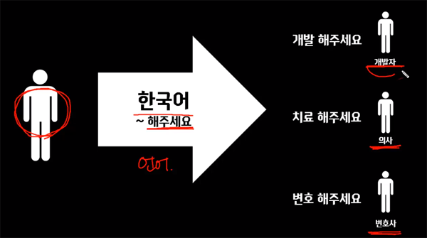

## javaScript 란?
- 웹브라우저를 프로그래밍적으로 제어하는 언어로 동작을 담당
- 웹브라우저에서 유일하게 사용할 수 있는 프로그래밍 언어

## 역사
- HTML이 화면에 출력된 후 형태나 동작방법을 바꿀 수 없는 문제를 해결하기 위해 네스케이프에서 만들어졌고 마이크로소프트의 인터넷 익스플로러에 jscript라는 이름으로 탑재된다. 그 후, ECMA라는 표준화 기구로 관리주체가 옮겨졌다.

## ECMAScript
- ECMAScript는 표준화 기구인 Ecma International에 의해서 관리되는 자바스크립트 표준안이다.

## 언어와 환경
- 언어란 의사소통을 위한 약속이다.

- 언어라는 공통분모로 각각의 환경을 제어한다.

> 각각 환경에따라 환경이 할 수 있는 일이 다르고 할 수 있는 일에 따른 명령어가 다르다.

## JavaScript로 할 수 있는 일
#### 웹페이지 스크립팅
- DOM
> 웹브라우저 제어

#### 서버측 스크립팅
- Node.js
> 탈웹브라우저 : JavaScript 언어를 서버에서 사용

#### 탈웹
- Google Apps Script
> 웹 바깥쪽에서 JavaScript 언어를 사용

#### 그 외
- 브라우저 확장기능
- Adobe PDF
- Tools in the Adobe Creative Suite
- OpenOffice.org
- Unity 게임 엔진
- 채팅 시스템

## 참고사이트
- [jQuery를 만든 John Resig의 JavaScript 고급 강의](http://ejohn.org/apps/learn/)
- [모질라(Firefox)에서 운영중인 JavaScript 튜토리얼](https://developer.mozilla.org/ko/docs/JavaScript/Guide)
- [html5rocks](http://www.html5rocks.com/ko/)
- [JavaScript 사전](http://opentutorials.org/course/50)
> Javascript 사전 이용시, 대괄호[값]은 생략가능의

## 자료출처
- [JavaScript - 생활코딩](https://opentutorials.org/course/743)
