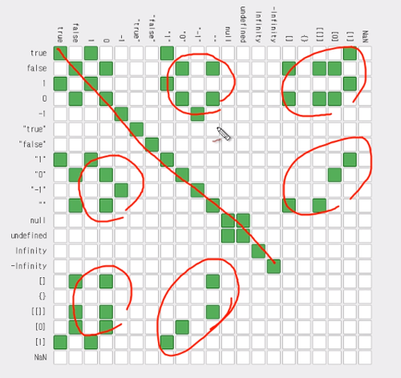

## 연산자
- 값에 대해서 어떤 작업을 컴퓨터에게 지시하기 위한 기호
### `=` : 대입(이항)연산자
```
a = 1
```
> a(변수)에 1(값)을 대입(이항)

### 변수와 상수
- 변수의 반대는 상수로, 상수는 변수에 대항되는 개념이다.
```
1 = 2
```
> 말이 안됨<br/>1과 2는 각각 고정 된 값인 상수이므로 식이 성립할 수 없다.


## 비교 연산자
- 프로그래밍에서 비교란 주어진 값들이 같은지, 다른지, 큰지, 작은지를 구분하는 것을 의미
- 비교 연산자의 결과는 boolean으로 true 또는 false로 출력


### Date Type : 정보 형식
- number : 숫자 1, 2, 3 ...
- string : 문자 "a", "b", "c" ...
- boolean : true(참), false(거짓)
- null : 값을 의도적으로 정의하지 않음 (의도O)
- undefinde : 값이 없음 (의도X)
```
var a = null;
alert(a);  // null
```
> 의도적으로 값을 없다고 지정
```
var a;
alert(a);  // undefined
```
> a라는 변수는 존재하지만 그 안에 어떠한 값도 정의되지 않음


### `==` : 동등 연산자(equal operator)
- 좌항과 우항이 같다면 true 다르면 false
```
alert(1==2)  // false
alert(1==1)  // true
alert("one"=="two")  // false 
alert("one"=="one")  // true
```
```
console.log(true == 1)  // true 
```
> 동등 연산자는 1을 true로 간주하고 나머지는 모두 false로 받아들임


### `===` : 일치 연산자(strict equal operato)
- 엄격한 동등 연산자
- 의미, 정보, 데이터타입이 같은 경우에만 true
- 되도록 이것을 사용하는 것이 좋음
```
alert(1=='1');  // true
alert(1==='1');  // false
```
> 실직적인 의미(정보)는 동일하나, 데이터 타입이 다름

```
console.log(undefinde == null)  // true
console.log(undefinde === null)	 // false
```
> 둘 다 값이 없다는 데이터 형태로 의미는 동일하나, null은 값이 없음을 명시적으로 표시하고 undefined는 그냥 값이 없는 상태로 다름

```
alert(true == 1);  // true
alert(true === 1);  // false
```
> 동등 연산자는 1을 true로 간주

```
console.log(0 === -0)  // true
```
> 양수건 음수건 0 은 0

```
console.log(Nan === Nan) // false
```
> Nan은 없는 수, 성립하지 않는 수, 계산할수 없음 (ex. 0/0), 숫자가 아니라는 뜻

### `!=` : 같지 않다
- !는 부정을 의미
- = (같다)의 ! (부정) 즉, 같지 않다는 != 가 된다.
- == 의 정반대
```
alert(1!=2);  // true
alert(1!=1);  // false
alert("one"!="two");  // true
alert("one"!="one");  // false
```
> true 1==2 false인데 != 때문에 반대로 true가 됨<br/>즉, 결과를 역전시킴
	
### `!==` : 정확하게 같지 않다
- === 의 반대

### `>` 
- 좌항이 우항보다 크다면 참, 그렇지 않다면 거짓
- `<` 는 반대로 의미함
```
alert(10>20);  // false
alert(10>1);   // true
alert(10>10);  // false
```

### `>=`
- 좌항이 우항보다 크거나 같다
- `<=` 는 반대로 의미함
```
alert(10>=20);  // false
alert(10>=1);  // true
alert(10>=10);  // true
```

### 참고
- [== 과 === 의 차이점](https://dorey.github.io/JavaScript-Equality-Table/)



> 예외의 경우를 다 이해할 자신이 없다면 === 를 쓰자!
