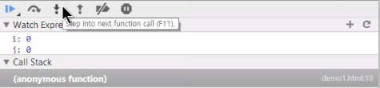
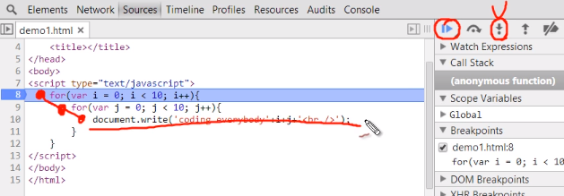

# 반복문 (loop, iterate)
- ~ 동안
- 조건문은 프로그램을 똑똑하게, 반복문은 강력하게 만든다.
- 이 두가지의 큰 축으로 프로그램을 만들어간다.

## while
```
while(조건){
  반복해서 실행할 코드
}
```
> 조건에는 Boolean이 온다.<br />true에서 false가 될때까지 반복
```
while(true){
  document.write('coding everybody <br />');
}
```
> 문서에 coding everybody를 무한대로 실행 (무한루프에 빠짐)<br/>해결은 true가 적당한시점에 false가 되어줘야 한다.<br/>그래서 반복조건이 존재함

- while문은 크게 3가지의 구문으로 구성
1. 초기화 : 변수 초기화 (기준점 제공)
2. 반복구문 : 반복이 될때마다 실행될 코드 (반복적으로 실행될때마다 변수값 갱신함)
3. 반복조건 : 계속 반복할지를 체크 (종료조건)
```
var i = 0;                        // 1.
while(i < 10){                    // 3.
  document.write('coding<br />');  
  i = i + 1;                      // 2.   
}
```
> i가 10보다 작으면 true, 같거나 크면 false가 됨<br />반복이 실행될 때마다 coding이 출력<br />i의 값이 1씩 증가

- `i = i + 1; / i += 1; / i++ : (반복문이 실행될때마다) 1씩 증가시킴`

※ 주의 : 프로그래밍에서는 숫자를 0부터 카운팅함

## for
- while의 패턴들을 문법적인 요소로 결합해 만듬
- while문 보다 가독성이 더 좋음
```
for(초기화; 반복조건; 반복구문){ 
  반복해서 실행될 코드
}
```
> 순서엄수, 마지막 세미콜론(;) 반드시 생략
```
for(var i = 0; i < 10; i++){
  document.write('coding everybody'+i+'<br />');    	
}
```
- 실행순서
1. 초기화 (한번만 실행)
```
var i = 0;
```
2. 반복조건 실행
```
i < 10;
```
> 0 < 10; 로 true 실행
3. {} 코드 실행
```
document.write('coding everybody'+i+'<br />');
```
> coding everybody'+0+'<br /> 이 출력
4. 반복구문 실행
```
i++
```
> 0 이었던 i를 1 증가시킴 i = 1
5. 반복조건 실행
```
1 < 10;
```
> true 실행
6. {} 코드 실행
```
document.write('coding everybody'+1+'<br />');
```
7. 반복하다가 반복조건이 false가 되면 for문 종료 후 반복문 바깥의 내용이 실행
```
i = 10
10 < 10;
```
> 10 < 10 는 false로 for문이 종료 됨
- 결과
```
coding everybody 0
coding everybody 1
coding everybody 2
...
coding everybody 8
coding everybody 9
```

### i++ 와 ++i 의 차이
- i++는 i를 리턴하고 값을 더함<br/>즉, 기존의 값을 사용하고 1을 증가시킴<br/>대체적으로 많이 사용
- ++i는 i의 값을 더하고 리턴<br/>즉, 사용할 때 증가시킨 후 사용함
```
var i = 0;
i++  // 0
alert(i);  // 1


var i = 0;
++i  // 1
alert(i);  // 1
```
```
var i = 0;
alert(i++);  // 0

var i = 0;
alert(++i);  // 1
```


## 반복문의 제어
## break
- 반복문을 완전히 종료시키고 빠져나감
- 반복작업을 중간에 중단시키고 싶을 때 사용
```
for(var i = 0; i < 10; i++){
  if(i === 5) {
    break;
  }
  document.write('coding everybody'+i+'<br />');
}
```
- 결과
```
coding everybody 0
coding everybody 1
coding everybody 2
coding everybody 3
coding everybody 4
```
> if(i === 5)에 의해 i값이 5가 되어 진입할때 break가 실행되면서 반복문이 종료됨


## continue
+ 반복문을 일시정지시키고 다시 반복문 실행
+ 실행을 즉시 중단하면서 반복은 지속되게 함
```
for(var i = 0; i < 10; i++){
  if(i === 5) {
    continue;
  }
  document.write('coding everybody'+i+'<br />');
}
```
- 결과
```
coding everybody 0
coding everybody 1
coding everybody 2
coding everybody 3
coding everybody 4
coding everybody 6
coding everybody 7
coding everybody 8
coding everybody 9
```
> i값이 5일때 continue를 만나 실행이 중단되어 continue 뒤에 코드는 실행되지 않음<br />반복문 자체는 중단되지 않았기 때문에 다시 반복문이 실행되어 나머지 결과가 출력됨


## 반복문의 중첩
- 반복문 안에는 다시 반복문이 나타날 수 있음
```      
for(var i = 0; i < 10; i++){
  for(var j = 0; j < 10; j++){
    document.write(String(i)+String(j)+'<br />');
  }
}
```
> 바깥쪽 i에 대한 for문이 한번 실행될때, 안쪽 j에 대한 for문이 10번 실행됨

> 0부터 9까지 변수 i에 순차적으로 값을 할당<br />0부터 9까지의 변수를 j에 순차적으로 할당<br />i와 j의 값을 더한 후 출력<br />i와 j는 String()에 의해 문자열의 형태로 더해짐
```
document.write('coding everybody'+i+j+'<br />');
```
> 단, 문자와 숫자가 결합되면 숫자는 문자열로 받아들여져 이때 i와 j는 문자열이 됨
- 결과
```
00
01
02
~
98
99
```


## 디버거
- 디버거 : 디버그를 하는 도구
  - 디버그 : 오류를 제거
- 코드가 실행되는 과정을 눈으로 확인할 수 있는 도구
- [반복문의 중첩(6/6)](https://opentutorials.org/course/743/4728) 4:00 ~
1. 개발자도구에서 Sources 메뉴 클릭
2. 좌측에서 원하는 파일불러오기


3. 원하는 코드라인에 멈출구간의 숫자 클릭해서 Breakpoints(일시정지)를 걸어준 뒤 새로고침


> 디버거에 의해 일시정지되어 있음
4. 우측 Watch Expressions에 찾고싶은 코드를 + 버튼을 눌러 입력하면(ex. i 와 j) 해당 코드의 값이 나옴

5. 위쪽 화살표 버튼을 이용해 하나씩 단계별로 코드가 실행되는 모습을 watch와 화면을 통해서 볼 수 있음



6. 지정한 코드라인을 다시 클릭해 일시정지를 해제시키고 화살표 버튼 쪽 플레이버튼을 누르면 디버거는 종료됨


