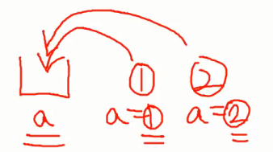
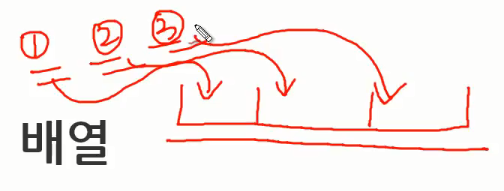
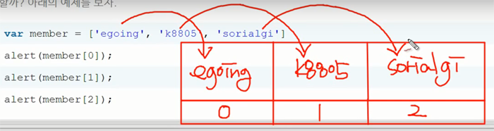

## 배열(array)
- 연관된 정보(데이터)를 한꺼번에 관리하기 위해 사용하는 데이터 타입
- 변수가 하나의 데이터를 담기위한 것이라면 배열은 여러개의 데이터를 하나의 변수에 담기위한 것<br/>
<br/>
> 변수<br/>

<br/>
> 배열

```
var member = ['egoing', 'k8805', 'sorialgi']
```
> 각각의 데이터를 원소(Element)이라고 부름
```
var member = ['egoing', 'k8805', 'sorialgi']
alert(member[0]);
alert(member[1]);
alert(member[2]);
```
> 원소 각각에게 식별자로 고유한 숫자인 색인(index)이 주어짐<br />색인은 0부터 시작

<br/><br/>


## 배열의 효용
- 함수는 여러개의 입력값을 받지만 하나의 출력값을 받는 한계가 있고 이를 해결하는것이 배열
```
function get_member1(){
  return 'egoing';
}
document.write(get_member1());
 
function get_member2(){
  return 'k8805';
}
document.write(get_member2());
  
function get_member3(){
    return 'sorialgi'
}
document.write(get_member3());
```
> 배열이 없다면 코드가 복잡해짐

```
function get_members(){
  return ['egoing', 'k8805', 'sorialgi'];
}
var members = get_members();
document.write(members[0]);
document.write(members[1]);
document.write(members[2]);
```
> 배열을 통해서 함수에서 여러개의 출력값을 가져올 수 있게 됨


## 배열의 사용
- 배열의 진가는 반복문과 결합했을 때 나타남
- 배열은 배열에 담긴 값을 하나하나 꺼내서 꺼내진 값들을 가공하는것이 핵심
```
function get_members(){
  return ['egoing', 'k8805', 'sorialgi'];
}

var members = get_members();

for(i = 0; i < members.length; i++){
  document.write(members[i].toUpperCase());   
  document.write('<br />');
}
```
> return은 하나의 값을 받지만 그 값 안에 배열이 들어있어서 여러개의 값들이 들어갈 수 있게 됨<br />값을 호출해 members에 담음<br />members의 갯수만큼 반복문 실행

- `.length : 갯수 (변수의 형태)`
- `.toUpperCase() : 소문자를 대문자로 변환 (내장함수)`

- 결과
```
EGOING
K8805
SORIALGI
```


## 원소의 추가
- 인자로 전달된 값을 배열에 추가하는 명령어들
### [push](https://opentutorials.org/course/50/105)
- 배열 끝에 원소를 추가
```
var li = ['a', 'b', 'c', 'd', 'e'];

li.push('f');

alert(li);  // ['a', 'b', 'c', 'd', 'e', 'f']
```

### [concat](https://opentutorials.org/course/50/102)
- 복수의 원소를 배열에 추가
```
var li = ['a', 'b', 'c', 'd', 'e'];

li = li.concat(['f', 'g']);

alert(li);  // ['a', 'b', 'c', 'd', 'e', 'f', 'g']
```


### [unshift](https://opentutorials.org/course/50/112)
- 인자로 전달한 값을 배열의 첫번째 원소로 추가하고 배열의 기존값들의 색인을 1씩 증가시킴
```
var li = ['a', 'b', 'c', 'd', 'e'];

li.unshift('z');

alert(li);  // ['z', 'a', 'b', 'c', 'd', 'e']
```
> 맨앞에 추가되어 z의 색인이 0이 됐기때문에 기존값들의 색인을 1씩 증가시킴


### [splice](https://opentutorials.org/course/50/110)
```
array.splice(index, howmany, element1, ..., elementN);
```
- index : 배열에 추가할 특정 배열의 위치를 가르킴
- howmany : index를 시작으로 제거 될 원소의 수 (0이면 어떠한 원소도 삭제X)
- elementN : index와 howmany 사이에 추가 될 값
```
var li = ['a', 'b', 'c', 'd', 'e'];

li.splice(2, 0, 'B');

alert(li);  // ['a', 'b', 'B', 'c', 'd', 'e']
```
> 인덱스가 2번째인 c를 삭제하지않고 앞에 B를 추가

```
var li = ['a', 'b', 'c', 'd', 'e'];

li.splice(2, 1, 'X');  // ['c']

alert(li);  // ['a', 'b', 'X', 'd', 'e']
```
> splice는 함수를 호출했을때 두가지 기능을 함<br/>1. 해당배열에 담긴 값을 바꿈<br/>2. 그 과정에서 삭제된 데이터를 리턴해줌


## 원소의 제거
### [shift](https://opentutorials.org/course/50/107)
- 첫번째 원소 제거
```
var li = ['a', 'b', 'c', 'd', 'e'];

li.shift();

alert(li);  // ['b', 'c', 'd', 'e']
```

### [pop](https://opentutorials.org/course/50/104)
- 마지막 원소 제거
```
var li = ['a', 'b', 'c', 'd', 'e'];

li.pop();

alert(li);  // ['a', 'b', 'c', 'd']
```


## 원소의 정렬
### sort
- 알파벳 순서로 정렬
```
var li = ['c', 'e', 'a', 'b', 'd'];

li.sort();

alert(li);  // ['a', 'b', 'c', 'd', 'e']
```

### reverse
- 역순으로 정렬
```
var li = ['c', 'e', 'a', 'b', 'd'];

li.reverse();

alert(li);  // ['d', 'b', 'a', 'e', 'c']
```

- 배열을 원하는대로 정렬 : Javascript 사전 [sort](https://opentutorials.org/course/50/109) 참고
  - .sort(sortfunc) 예제참고
