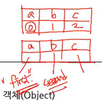

## 객체(Object)
- 데이터를 담는점에서 비슷한 배열과 객체의 차이점
    - 배열 : 아이템에 대한 식별자로 숫자를 사용<br/>순서중요
    - 객체 : index에 문자 또는 원하는 index를 사용해 데이터를 담음<br/>순서상관없음
<br/><br/>
- `{ }` : 객체
- 객체는 속성을 가짐
- 배열에서 색인은 key 이고, 연결된 값은 value
```
var grades = {'egoing': 10, 'k8805': 6, 'sorialgi': 80};
```
> {'key' : value}

- 또 다른 정의방법
```
var grades = {};  // 또는 var grades = new Object();

grades['egoing'] = 10;
grades['k8805'] = 6;
grades['sorialgi'] = 80;
```
- 다양한 호출방식
```
var grades = {'egoing': 10, 'k8805': 6, 'sorialgi': 80};

alert(grades['sorialgi']);
alert(grades['sorial'+'gi']);
alert(grades.sorialgi);
```
> 결과는 모두 80<br/>단, grades.'sorial'+'gi' 는 안됨X

- 객체는 데이터를 담는 그릇에서 프로그램을 구조적이고 부품으로써 사용될수있는 단위로 확장해나간다.

## 객체와 반복문의 이용
### for in loop
- 객체의 속성을 열거할때 사용
    - 배열을 열거할때는 for문
    - 객체를 열거할때는 for in문
        
```
for(key in ***){}

for(var name in ***){}
```
> in 뒤에 *** 는 객체이름(객체가 담긴 변수의 이름)이 오고 in 앞에 key에는 해당 객체의 key값이 순차적으로 할당 
```
var grades = {'egoing': 10, 'k8805': 6, 'sorialgi': 80};

for(key in grades) {
  document.write("key : "+key+" , value : "+grades[key]+"<br />");
}
```
- 결과
```
key : egoing , value : 10
key : k8805 , value : 6
key : sorialgi , value : 80
```
> for문은 in 뒤 배열의 key 값을 in 앞 변수 name(=key)에 담아서 반복문을 실행<br />반복문이 실행될 때 변수 key의 값으로 egoing, k8805, sorialgi가 순차적으로 할당 됨<br />이 때문에 grades[key]를 통해서 객체의 값을 알아낼 수 있음
```
<ul>
  <script>
  var grades = {'egoing': 10, 'k8805': 6, 'sorialgi': 80};

  for(key in grades) {
    document.write("<li>"+"key : "+key+" , value : "+grades[key]+"</li>");
  }
  </script>
</ul>
```
> 자바스크립트를 이용해 프로그래밍적으로 웹페이지를 생성 (html을 제어)

- 배열을 이용한 for in 문
```
var arr = ['a','b','c'];

for(var name in arr){
  console.log(name);  // 0,1,2
  console.log(arr[name]);  // a,b,c
}
```
> 배열이라 식별자로 index를 사용해 0,1,2가 key값이 되고 value가 a,b,c 됨


## 객체지향 프로그래밍
- 연관되어 있는것들을 하나의 그릇에 모아 그룹핑 해놓은 스타일 기법
- 객체에는 객체뿐만 아니라 함수도 담을 수 있음<br/>이것은 메소드가 됨
```
var grades = { 
  'list' : {'egoing': 10, 'k8805': 6, 'sorialgi': 80}
}
console.log(grades['list']);  // {'egoing': 10, 'k8805': 6, 'sorialgi': 80}
```
> grades객체 안에 list객체가 들어있고 list의 key에는 value가 객체로 들어있음

```
var grades = { 
  'list' : {'egoing': 10, 'k8805': 6, 'sorialgi': 80},
  'show' : function(){
    alert('Hello world');
  }
}
console.log(grades['list']['egoing']);  // 10
grades['show']();  // Hello world
```
> 객체안에 객체와 함수가 들어있음<br/>객체안에 함수가 들어간다는 것은 함수도 일종의 값이고 변수에 저장될수있다는 것을 의미함<br/>즉, 값으로써의 함수는 객체안에 저장이 가능함

### this
- 약속된 변수
```
var grades = {
  'list' : {'egoing': 10, 'k8805': 6, 'sorialgi': 80},
  'show' : function(){
    console.log(this.list);  // {'egoing': 10, 'k8805': 6, 'sorialgi': 80}
  }
}
grades['show']();
```
> 여기에서 this는 해당 함수(function)를 소유하고있는 객체(=grades)를 가리킴
```
var grades = {
  'list' : {'egoing': 10, 'k8805': 6, 'sorialgi': 80},
  'show' : function(){
    for(var name in this.list){
      console.log(name, this.list[name]);
    }
  }
}	
grades.show(); // == grades['show']();
```
- 결과
```
egoing 10
k8805 6
sorialgi 80
```
> ','를 통해서 여러가지를 한꺼번에 출력할 수 있음

- 객체(grades)안에 데이터(list)가 있고 그 데이터를 사용하는 함수(show)가 들어있음<br/>객체의이름.함수 로 함수를 호출가능<br/>서로 연관된 데이터와 함수(처리)를 하나의 객체에 카테고라이징(그룹핑)한 것이 객체지향프로그래밍

<br/><br/>
