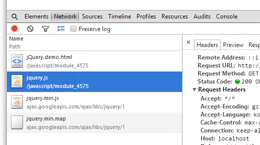

프로그램은 작고 단순한 것에서 크고 복잡한 것으로 진화하는데 그 과정에서 코드의 재활용성을 높이고 유지보수에 용이한 다양한 기법들이 사용된다.<br/>그 중에 하나가 코드를 여러개의 파일로 분리하는 것이다.

## 모듈(module)
- 수 많은 로직을 재사용할 수 있는 단위로 나누어 모듈이라는 형태로 떼어내 다른 프로그램에 부품으로 사용하는 기법 또는 그 부품들<br/>즉, 로직들을 부품화한 것
- 이러한 기법 즉, 부품화하는 과정을 모듈화(Modularization)라고 함
- 코드를 여러개의 파일로 분리하게 되면 코드의 재활용성을 높이고 유지보수에 용이해지며 가독성이 좋아짐


### 얻어지는 효과
- 자주 사용되는 코드를 별도의 파일로 만들어 필요할 때마다 재활용할 수 있음 (재사용성)
- 코드를 개선하면 이를 사용하고 있는 모든 애플리케이션의 동작이 개선 됨 (유지보수 용이)
- 코드 수정 시 필요한 로직을 빠르게 찾을 수 있음 (가독성)
- 필요한 로직만을 로드해서 메모리의 낭비를 줄일 수 있음
- 한번 다운로드 된 모듈(JavaScript)은 웹브라우저에 의해 저장되어 동일한 로직을 로드할 때 시간과 네트워크 트래픽을 절약 할 수 있음 (브라우저에서만 해당)


### 호스트 환경
- 순수한 자바스크립트는 모듈 개념이 존재하지 않지만, 구동되는 호스트 환경에 따라 각각의 다른 모듈화 방법이 제공됨
- javascript가 구동되는 환경
- 웹브라우저를 위한 언어(클라이언트)로 시작했지만, 서버측에서 실행되는 JavaScript(node.js)와 구글스프레드시트에서의 JavsScript(Google Apps Script)등이 있음<br/>즉, 사용하려는 호스트환경에 따라 모듈의 로드방법이 다르기때문에 환경에 따른 각각의 방법을 익혀야함


## 웹브라우저에서 로직을 모듈화
- 모듈이 없는 애플리케이션
```
function welcome(){
  return 'Hello world'
}
alert(welcome());
```
> welcome 함수가 자주 사용된다면 필요할때마다 이 함수를 정의해서 사용해야 함<br/>한 파일의 덩치가 커지고 복잡해짐

- 모듈의 사용
1. greeting.js 라는 JavaScript 파일을 만듬
```
function welcome(){
  return 'Hello world';
}
```
> 함수를 정의해서 HTML의 외부파일로 분리

2. head 태그에 선언
```
<script src="greeting.js"></script>
```
> 어느 페이지에서든 greeting.js를 선언해주면 welcome 함수를 사용가능

3. HTML에서 호출하여 사용
```
alert(welcome());
```
> HTML에 호출한다는 정보만 노출함으로써 가독성이 높아지고 코드의 양이 줄어듬


## 라이브러리
- 목적을 정하고 목적을 쉽게 달성하도록 만들어놓은 로직들의 집합
- 모듈과 비슷한 개념으로 모듈이 프로그램을 구성하는 작은 부품으로서의 로직을 의미한다면<br/>라이브러리는 자주 사용되는 로직을 재사용하기 편리하도록 잘 정리한 코드들의 집합을 의미
- 유명한 라이브러리로는 jQuery가 있음
- 다른사람이 이미 만들어 놓은 부품으로 조립해서 만들어 가는것이 소프트웨어를 만드는 '기본중의 기본'


## 라이브러리의 사용
- JavaScript로 웹브라우저를 제어한다는 목적에서 가장 많이 사용하는 라이브러리는 jQuery

### jQuery
1. [jQuery 홈페이지](http://jquery.com/)에서 파일을 다운 (모듈 가져오기)
2. [jQuery 메뉴얼](http://api.jquery.com/)을 이용해서 사용법을 파악 (API)
3. jQuery 사용

- 예제
1. 선언
```
<script src="https://code.jquery.com/jquery-1.11.0.min.js"></script>

<script src="경로/jquery.js"></script>
```
> 링크주소를 선언하는 방법과 파일을 다운받아 선언하는 방법 두가지가 있음

<br/><br/>
> 다운을 받아서 사용했다면 Network 탭을 통해 해당 웹브라우저가 다운받아 로드한 파일들을 확인가능하다.

2. 사용
```
<ul id="list">
  <li>empty</li>
  <li>empty</li>
  <li>empty</li>
  <li>empty</li>
</ul>
<input id="execute_btn" type="button" value="execute" />
```
```
$('#execute_btn').click(function(){
  $('#list li').text('coding everybody');
})
```
> 모든 li 안에 empty 텍스트가 coding everybody로 변경 됨

- jQuery를 이용하지 않고 동일한 기능을 구현
```
function addEvent(target, eventType,eventHandler, useCapture) {
  if (target.addEventListener) {  // W3C DOM
    target.addEventListener(eventType,eventHandler,useCapture?useCapture:false);
  } else if (target.attachEvent) {  // IE DOM
    var r = target.attachEvent("on"+eventType, eventHandler);
  }
}
function clickHandler(event) {
  var nav = document.getElementById('list');
  for(var i = 0; i < nav.childNodes.length; i++) {
    var child = nav.childNodes[i];
    if(child.nodeType==3)
      continue;
      child.innerText = 'Coding everybody';
  }
}
addEvent(document.getElementById('execute_btn'), 'click', clickHandler);
```
