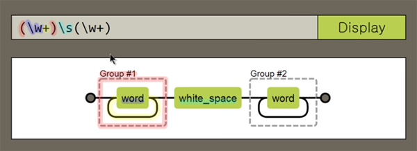
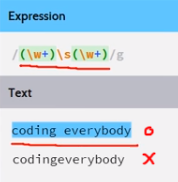

## 정규표현식(regular expression)
- 문자열에서 패턴을 찾아내서 특정한 문자를 찾아내거나 치환하는 도구
- 수십줄이 필요한 작업을 한줄로 끝낼 수 있음
- 정규표현식 자체에 대한 학습은 [정규표현식 수업](https://opentutorials.org/course/909/5142) 참고
  - 정규표현식 자체도 언어임이므로 여러곳에서 사용됨 (Java, Perl ...)
  - 현재 자료들은 정규표현식을 JavaScript에서 사용하는 법에 대해서 정리하고 있음
  - 정규표현식은 웹(정보)에서 사용되는 강력한 언어이므로 언젠간 공부를 해야함


## 정규표현식 생성
- 정규표현식은 컴파일과 실행 두가지 단계로 이루어짐
- 컴파일(compile) : 검출하고자 하는 패턴을 만드는 일 (대상 찾기)
  - 컴파일의 두가지 방법 : 정규표현식 리터럴, 정규표현식 객체 생성자
- 실행(execution) : 대상에 대한 구체적인 작업 (추출, test, 치환 ...)


### 정규표현식 리터럴
```
var pattern = /찾고자하는 대상/;
```

### 정규표현식 객체 생성자
```
var pattern = new RegExp('찾고자하는 대상');
```

## 정규표현식 메소드 실행 (RegExp 객체의 사용)
- 작업순서
1. 대상찾기
2. 대상을 어떻게 작업할건지를 정의
3. 대상을 사용

- 정규표현식 작업순서
1. 대상을 추출 (패턴 만들기)
2. 대상의 존재유무 테스트
3. 대상을 다른 정보로 치환

### RegExp.exec()
- 추출
- 결과값은 배열로 출력
```
RegExp.exec('검색의 대상');
```
```
var pattern = /a/;

console.log(pattern.exec('abcdef'));  // ["a"]
```
> 문자열 a를 값으로 하는 배열을 리턴

```
var pattern = /a./;

console.log(pattern.exec('abcdef'));  // ["ab"]
```
- `var pattern = /*./ : * 뒤에 반드시 하나의 문자를 출력`<br/>" . " 은 특수한 기호로 하나의 문자를 뜻함<br/>어떠한 문자가 오든지 상관없지만 반드시 하나의 문자가 와야하고 그 앞에는 반드시 a가 있어야 한다는 의미

```
var pattern = /a/;

console.log(pattern.exec('bcdefg'));  // null
```
> 인자(검색대상) 'bcdef'에는 a가 없기 때문에 null을 리턴


### RegExp.test()
- 찾고자하는 대상의 존재유무 테스트
- 인자의 패턴에 해당되는 문자열이 있으면 true, 없으면 false를 리턴
```
RegExp.test('검색의 대상');
```
```
var pattern = /a/;

console.log(pattern.test('abcdef'));  // true
```
```
var pattern = /a/;

console.log(pattern.test('bcdefg'));  // false
```


## 문자열 메소드 실행 (String과 정규표현식)
### String.match()
- RegExp.exec()와 비슷함
```
String.match();
```
```
var pattern = /a/;

console.log('abcdef'.match(pattern));  // ['a']
console.log('bcdefg'.match(pattern));  // null
```
```
var pattern = /a/;
var str = 'abcdef';

console.log(str.match(pattern));  // ['a']
```
> 변수에 담아서도 표현이 가능

### String.replace()
- 문자열에서 패턴을 검색해서 이를 변경한 후에 변경된 값을 리턴 (치환)
```
String.replace(치환될대상, '치환할값');
```
```
var pattern = /a/;

console.log('abcdef'.replace(pattern, 'A'));  // Abcdef
```


## 옵션
- 정규표현식 패턴을 만들 때 옵션을 설정할 수 있음
- 옵션에 따라서 검출되는 데이터가 달라짐

### i
- i를 붙이면 대소문자를 구분하지 않음
```
var xi = /a/;
console.log("Abcde".match(xi));  // null

var oi = /a/i;
console.log("Abcde".match(oi));  // ["A"];
```

### g
- g를 붙이면 검색된 모든 결과를 리턴
```
var xg = /a/;
console.log("abcdea".match(xg));  // ["a"];

var og = /a/g;
console.log("abcdea".match(og)); // ["a", "a"];
```

- 같이 사용가능
```
var ig = /a/ig;

console.log('AabcdeAa'.match(ig)); // ["A" ,"a" ,"A" ,"a"];
```


## 캡처
- 그룹을 지정하고 그 그룹을 가져와서 사용하는 기능
- '$'를 사용해 괄호안에 패턴을 마치 변수처럼 재사용
  - $ : 그룹()을 의미
```
var pattern = /(\w+)\s(\w+)/;

/~/ : 검색
(~) : 그룹
\w  : 문자 혹은 숫자 (A~Z, a~z, 0~9)
 +  : 하나 이상의 (수량자)
\s  : 공백, 스페이스바
```
- [정규표현식을 시각화](https://regexper.com/)

<br/><br/>

- [정규표현식 빌더](https://regexr.com/)

<br/><br/>

```
var pattern = /(\w+)\s(\w+)/;
var str = "coding everybody";
var result = str.replace(pattern, "$2, $1");

console.log(result);
```
- 결과
```
everybody, coding
```
> $2 두번째 그룹(everybody)이 먼저 오고 뒤에 $1 첫번째 그룹(coding)이 온다.<br/>그 사이에 \s 대신 ', '가 온다.<br/>즉, 패턴에 알맞게 해당되는 문자를 찾아 정의($)에 맞게 치환함


```
var urlPattern = /\b(?:https?):\/\/[a-z0-9-+&@#\/%?=~_|!:,.;]*/gim;
var content = '생활코딩 : http://opentutorials.org/course/1 입니다. 네이버 : http://naver.com 입니다. ';
var result = content.replace(urlPattern, function(url){
  return '<a href="'+url+'">'+url+'</a>';
});

console.log(result);
```
- 결과
```
생활코딩 : <a href="http://opentutorials.org/course/1">http://opentutorials.org/course/1</a> 입니다. 네이버 : <a href="http://naver.com">http://naver.com</a> 입니다.
```
> 각 링크에 a태그가 들어감

- 참고
  - [생활코딩 정규표현식 수업](https://opentutorials.org/course/909/5142)<br />
  - [정규표현식을 시각화](https://regexper.com/)<br />
  - [정규표현식 빌더](https://regexr.com/)
