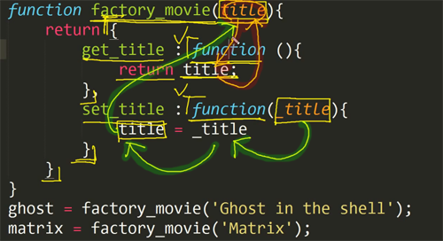
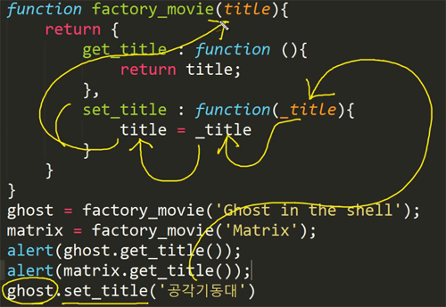
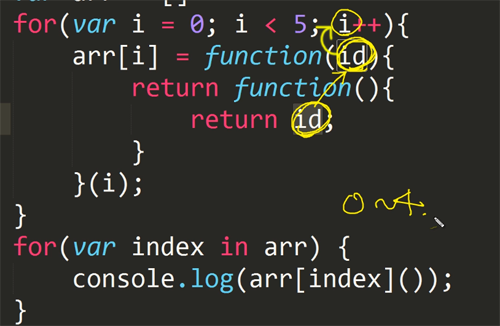

## 클로저(closure)
- 내부함수가 외부함수의 맥락(context)에 접근할 수 있는 것

### 내부함수
- 함수 안에서만 사용되는 함수로 충돌위험이 적다는 장점
- 자바스크립트는 함수 안에서 또 다른 함수를 선언할 수 있음
```
function outter(){
  function inner(){
    var title = 'coding everybody'; 
    alert(title);  // coding everybody 
  }
  inner();
}
outter();
```
> function inner(){} 는 var inner = function(){}; 와 같음<br/>즉, 외부함수의 지역변수 역할로 이 함수 안에서만 사용 될 함수인 것

> 함수 outter의 안에 함수 inner가 정의 되어 있음. 함수 inner를 내부 함수라고 함

```
function outter(){
  var title = 'coding everybody';
  function inner(){
    alert(title);
  }
  inner();
}
outter();  // coding everybody
```
> 내부함수 inner에서 title을 호출했을 때 내부에 title이 없다면, 외부함수인 outter의 지역변수인 title에 접근할 수 있음 = 클로저


### 클로저란?
- 외부함수의 실행이 끝나서 외부함수가 소멸된 이후에도 내부함수가 외부함수의 변수에 접근할 수 있는 메커니즘
```
function outter(){
  var title = 'coding everybody';  
  return function(){
    alert(title);
  }
}
var inner = outter();
inner();  // coding everybody
```
> 함수 outter();를 호출하는데 그 결과가 변수 inner에 담김<br/>return은 한번 실행 후 종료되기때문에 여기에서 외부함수는 종료<br/>그리고 실행이 inner();로 넘어오면 outter 함수는 실행이 끝났기 때문에 이 함수의 지역변수는 소멸됨<br/>그런데 함수 inner();를 실행했을 때 coding everybody가 출력된다는 것은 외부함수의 지역변수 title이 소멸되지 않았다는 것을 의미함<br/>inner();를 통해 내부함수를 다시 호출함으로써 이미 종료된 외부함수의 title에 접근해 값을 가져옴<br/>즉, 소멸 된 후에도 호출이 가능함

- 결국, 클로저란 내부함수가 외부함수의 지역변수에 접근 할 수 있으며 외부함수는 외부함수의 지역변수를 사용하는 내부함수가 소멸될 때까지 소멸되지 않는 특성을 의미함

## Private variable (비밀변수)
-  소프트웨어가 커지는 과정에서 제공된 어떠한 정보를 아무나 수정하는것을 방지하는 것
```
function factory_movie(title){
  return {
    get_title : function (){
      return title;
    },
    set_title : function(_title){
      title = _title
    }
  }
}
ghost = factory_movie('Ghost in the shell');
matrix = factory_movie('Matrix');
```


> 매개변수는 함수안에서 지역변수로 사용됨<br/>즉, 외부함수에 var title = title 가 있는 것

> 실행된 시점에서 외부함수의 지역변수에 접근하며 지역변수는 유지됨

<br/><br/>

> __매개변수는 함수에서 지역변수로 사용__ 되기 때문에 return title; 은 factory_movie(title){} 에서 title을 가져옴<br/>
function(_title) 은 title = _title의 _title이 되고 _title는 다시 title = _title의 title이 됨<br/>
이 title은 내부변수를 가르키기 때문에 factory_movie(title)의 title이 됨

```
alert(ghost.get_title());  // Ghost in the shell
alert(matrix.get_title());  // Matrix
 
ghost.set_title('공각기동대'); 
  
alert(ghost.get_title());  // 공각기동대
alert(matrix.get_title());  // Matrix
```
> ghost와 matrix는 똑같은 객체를 가졌지만 객체가 가진 get_title 메소드가 접근하는 title이라는 지역변수의 값은 다르기 때문에 결과가 다르게 출력됨<br/>그리고 ghost.set_title('공각기동대');에서 지역변수를 수정하지만, ghost 객체가 접근할수있는 title의 값만을 수정하기때문에 matrix 객체가 접근하는 것에는 영향을 미치지 않음

- __해설__
1. 클로저는 객체의 메소드에서도 사용할 수 있다. 위의 예제는 함수의 리턴값으로 객체를 반환하고 있다. 이 객체는 메소드 get_title과 set_title을 가지고 있다. 이 메소드들은 외부함수인 factory_movie의 인자값으로 전달된 지역변수 title을 사용하고 있다.
2. 동일한 외부함수 안에서 만들어진 내부함수나 메소드는 외부함수의 지역변수를 공유한다. ghost.set_title('공각기동대');에서 실행 된 set_title은 외부함수 factory_movie의 지역변수 title의 값을 '공각기동대'로 변경했다. alert(ghost.get_title()); 에서 ghost.get_title();의 값이 '공각기동대'인 것은 set_title와 get_title 함수가 title의 값을 공유하고 있다는 의미다.
3. 그런데 똑같은 외부함수 factory_movie를 공유하고 있는 ghost와 matrix의 get_title의 결과는 서로 각각 다르다. 그것은 외부함수가 실행될 때마다 새로운 지역변수를 포함하는 클로저가 생성되기 때문에 ghost와 matrix는 서로 완전히 독립된 객체가 된다.
4. factory_movie의 지역변수 title은 객체 return{}에서 정의된 _객체의 메소드_ 에서만 접근 할 수 있는 값이다. 이 말은 title의 값을 읽고 수정 할 수 있는 것은 factory_movie 메소드를 통해서 만들어진 객체 뿐이라는 의미다. JavaScript는 기본적으로 Private한 속성을 지원하지 않는데, 클로저의 이러한 특성을 이용해서 Private한 속성을 사용할 수 있게된다.

- __정리__<br/>
get_title과 set_title은 언제든, 누구든 접근가능한 오픈된 퍼블릭의 메소드이다.<br/>get_title과 set_title이 내부적으로 사용하고 있는 변수는 title이고 이것은 외부함수의 지역변수이다.<br/>이 지역변수인 title은 factory_mobie() 가 어떠한 값을 리턴했을 때 함수자체는 종료된다.<br/>그래서 title은 get_title과 set_title만 사용가능한 비밀변수가 된다.<br/>title을 get_title과 set_title을 통하지 않고서는 아무나 사용할 수 없으니 title을 외부에서 어떻게 사용하든 안에 맥락에는 영향이 없어 안전하다.<br/>title을 꽁꽁 숨겨놓고 title에 대한 수정은 set_title을 통해야만 하고, title을 가져올땐 get_title을 통해야만 가능하다면 title은 안전하게 저장된다.<br/>이렇게 클로저는 javascript가 private variable를 사용할 수 있게 하는 중요한 기능이다.

- __요약__ <br />
여기에서의 비밀함수는 title이다. function factory_movie()는 return을 해줌으로써 수명이 끝나서 그 지역변수인 title은 factory_movie의 내부함수인 get_title과 set_title을 통해서만 접근할수있는 비밀변수가 되었다.

- __장점__ <br />
title의 정보에 접근할수 있는 채널은 get_title과 set_title만이 접근가능하다. 그래서 title 변수의 값을 외부에서 어떠한 의미로 사용하던간에 그 안에 get_title과 set_title의 맥락은 영향을 미치지않는다. 그리고 공각기동대처럼 title을 수정하더라도 if문으로 조건을 줄수있다.
```
set_title : function(_title){
  if (typeof _title === 'string') {
    title = _title	
  } else {
    alert('제목은 문자열이어야 합니다')
  }			
}

ghost.set_title('공각기동대');  // 공각기동대
ghost.set_title('1');  // 제목은 문자열이어야 합니다
```
> title을 수정할때 typeof와 같은 제약을 걸면  더욱 안전하게 보관된다.

> title을 꽁꽁 묶어두고 변수를 set_title을 통해서만 변경할수있고 그 변수의 값을 가져올때는 get_title을 통해서만 가져올 수 있도록 하면 데이터는 더 안전하게 저장되고 안전하게 수정될 수 있다.

- __참고__ <br />
Private 속성은 객체의 외부에서는 접근 할 수 없는 외부에 감춰진 속성이나 메소드를 의미한다. 이를 통해서 객체의 내부에서만 사용해야 하는 값이 노출됨으로서 생길 수 있는 오류를 줄일 수 있다. 자바와 같은 언어에서는 이러한 특성을 언어 문법 차원에서 지원하고 있다.

> 이렇게 클로저는 특정 함수를 객체로 취급하여 `은닉화`, `캡슐화` 시키는 프로그래밍 패러다임이다.<br/>함수지향, 객체지향언어를 동시에 채택하는 자바스크립트에서 특별히 허용되어 있는 꼼수다. 함수의 인스턴스가 생을 마감하면 함수안에 저장되어있던 값도 운명을 따라간다.<br/>하지만 반환값이 함수이거나 메서드를 포함하는 객체일 경우, 함수를 지지고 볶으면 놀랍게도 이미 죽어있을 함수 내의 변수에 접근할 수 있다.<br/>이 때, 같은 외부함수인 다수의 내부함수는 지역변수를 공유한다.<br/>하지만 외부함수가 실행될 때 마다 지역변수를 공유하는 클로저가 별개로 생성되기 때문에, 다른 인스턴스일 경우 변수를 공유하지 않는다.<br/>이것으로 자바에서 private 접근자가 붙어있는 멤버 변수를 public 메서드로 접근하는 행위를 흉내내는것이 가능하다.


## 클로저의 응용
```
var arr = []
for(var i = 0; i < 5; i++){
  arr[i] = function(){ 
    return i;
  }
}

for(var index in arr) {
  console.log(arr[index]());  // 5 5 5 5 5
}
```

- __해석__ <br/>
return i 함수는 for문이 외부함수가 아니므로 for문의 i에 접근하지 못한다.<br/>그래서 arr[i]의 원소들은 0,1,2,3,4가 저장되는게 아닌 i,i,i,i,i가 저장된다. 즉, 아래의 상태인 것<br/><br/>
arr[0] = function(){return i;}<br/>
arr[1] = function(){return i;}<br/>
arr[2] = function(){return i;}<br/>
arr[3] = function(){return i;}<br/>
arr[4] = function(){return i;}<br/><br/>
즉, 이 코드는 arr배열에 익명함수의 설계도를 담은 것으로 함수를 실행한게 아니라 함수의 설계도를 배열에 저장한 것이다.<br/>
따라서 함수가 실행된게 아니니 각 배열에 담긴 것은 return될 i가 아니라 동작하기전 함수가 들어가 있는 것으로<br/>
var arr = [function(){return i;}, function(){return i;}, function(){return i;}, function(){return i;}, function(){return i;}]<br/>
이 상태가 된다. 그런 이유로 arr[index] 가 아닌 arr[index]\()이 되는 것이다. arr이 이미 i를 리턴 받은 상태라면 ()를 쓸 수 없을테니 여기서 함수가 실행되는 것.<br/><br/>
여기에서 루프를 통해 각 배열에 담겨있는 함수를 호출하게 되면 함수가 실행 후 return 값 i를 뱉게 되는데 여기서 i는 위에 for문이 자기 혼자 돌아가다가 끝나고 끝날 때의 값은 5가 되어 이 5는 for문이 끝나면서 for문을 벗어나 5가 i에 적용돼 i=5가 될 수 있는 것이다. 이 루프의 동작이 끝난 상태로 5가 되어 5를 5번 리턴한다.<br/><br/>
※ 이같은 오류를 막고 원래 의도대로 작동시키기 위해 즉, 내부함수의 태생적으로 한계가 있는 활용범위를 넓히는데 클로저가 활용될 수 있다.

- __간단한 해결책__ <br/>
처음 루프에서 함수를 즉시실행하면 된다. 함수가 즉시 실행돼서(함수) arr에 담기는 값은 function이 아니라 return값 i 가 된다. console.log(arr\[index]()); 이 루프 또 한 function 이 아닌 정수이므로 생성자 (); 를 빼주면 0,1,2,3,4를 볼수 있다.
```
var arr = []
for(var i = 0; i < 5; i++){
  arr[i] = function(){
    return i;
  }();
}
for(var index in arr) {
  console.log(arr[index]);  // 0 1 2 3 4
}
```

- __클로저를 통한 해결책__
```
var arr = []
for(var i = 0; i < 5; i++){
  arr[i] = function(id) {
    return function(){
      return id;
    }
  }(i);
}

for(var index in arr) {
  console.log(arr[index]());  // 0 1 2 3 4
}
```
<br/><br/>

> function(id){}로 외부함수를 만들어 지역변수의 역할을 준다. 즉, return function(){return id;} 내부함수는 function(id){}(); 외부함수의 지역변수인 id를 사용하고있다. i++의 i를 받아서 function(id){~}(i);의 i값이 id로 할당되면서 함수 내부로 전달하여 내부함수를 리턴해준다. 함수가 만들어지는 시점에서의 i 값을 외부함수가 id라는 지역변수로 가지고 있었기때문에 내부함수를 호출하게되면 그 지역변수인 id값을 리턴해주게 된다.

- __해석__<br/>
내부함수(클로저)를 외부 함수안에 넣어 내부함수가 외부함수의 변수를 참조할 수 있도록 한다. 외부함수의 입력인자가 내부함수의 return값이 되도록 외부함수의 입력인자와 배열의 원소이름 변수는 다르게 설정

- 참고 사이트<br/>
https://developer.mozilla.org/ko/docs/JavaScript/Guide/Closures<br/>
http://ejohn.org/apps/learn/#48<br/>
http://blog.javarouka.me/2012/01/javascripts-closure.html<br/>
