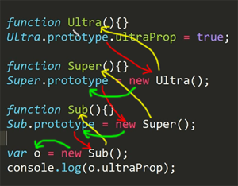

## prototype
- 원래의 형태
- 함수는 객체다. 그러므로 생성자로 사용될 함수도 객체다. 객체는 프로퍼티를 가질 수 있는데 prototype이라는 프로퍼티는 그 용도가 약속되어있는 특수한 프로퍼티다. prototype에 객체를 저장해두고 그 저장된 속성들은 생성자를 통해서 객체가 만들어질 때 그 객체에 연결된다.
```
function func(){}
console.log(func.prototype);  // func{} 빈객체

func.prototype.name = 'egoing'  // "egoing"

var o = new func();
console.log(o)  // func{name:"egoing"}
```

```
function Ultra(){}
Ultra.prototype.ultraProp = true;
 
function Super(){}
Super.prototype = new Ultra();
 
function Sub(){}
Sub.prototype = new Super();
 
var o = new Sub();
console.log(o.ultraProp);  // true
```
> 객체 o에서 ultraProp를 찾음<br/>없다면 Sub.prototype.ultraProp를 찾음<br/>없다면 Super.prototype.ultraProp를 찾음<br/>없다면 Ultra.prototype.ultraProp를 찾음<br/>즉, ultraProp는 객체 o 에 ultraProp는 함수가 있는지 찾고 없다면 생성자를 찾아내 생성자에 정의되어있는 prototype를 뒤져서 ultraProp를 찾아낸다.



> Super생성자가 만든 객체(prototype)가 new Super안에 들어감 Super생성자의 prototype객체는 new ultra로 만들어진 객체

`prototype chain : prototype는 객체와 객체를 연결하는 체인의 역할을 하는 것으로 이처럼 연결된 관계를 일컬음`

```
function Ultra(){}
Ultra.prototype.ultraProp = true;
 
function Super(){}
var t = new Ultra();
t.ultraProp = 4;
Super.prototype = t;
 
function Sub(){}
Sub.prototype = new Super();
 
var o = new Sub();
console.log(o.ultraProp);  // 4
```
