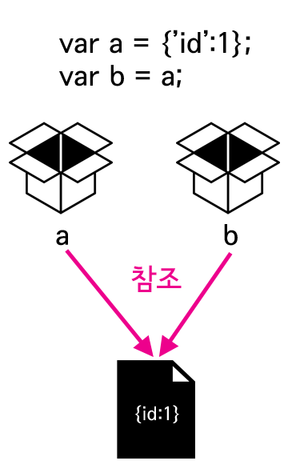

### 참조
## 복제
- 파일을 복사
- 변수에 담긴 데이터타입이 원시 데이터타입일때 작용
```
var a = 1;  // 원시 데이터
var b = a;
b = 2;
console.log(a);  // 1
```
> 값을 변경한 것은 변수 b이기 때문에 변수 a에 담겨있는 값은 그대로이다.<br/>단순히 변수 b의 값에 변수 a의 값이 복제된 것 뿐 원본을 바꾼다해서 또는 복제된 파일을 바꾼다해서 서로에게 영향을 주지않는다.


## 참조(reference)
- 파일을 참조
- 변수에 담긴 데이터타입이 원시 객체일때 작용
- 심볼릭 링크(symbolic link) 혹은 바로가기(윈도우)를 만드는 것과 같다.<br/>원본 파일에 대해서 심볼릭 링크를 만들면 원본이 수정되면 심볼릭 링크에도 그 내용이 실시간으로 반영되는 것과 같은 효과다.
```
var a = {'id':1};  // 객체
var b = a;
b.id = 2;
console.log(a.id);  // 2
```

> 객체에 담겨있는 프로퍼티값을 변경하면 원본에 프로퍼티값도 변경된다.

- 변수에 담겨있는 데이터가 원시형이면 그 안에는 실제 데이터가 들어있고, 객체면 변수 안에는 데이터에 대한 참조 방법이 들어있다고 할 수 있다.

```
var a = {'id':1};
var b = a;
b = {'id':2};  // 객체생성
console.log(a.id);  // 1
```
> 새로운 객체를 만듬으로써 심볼릭 링크가 깨짐

```
var a = 1;
var b = a;
b = 2;  // 객체생성
console.log(a);  // 1
```
> 결국, 복제와 참조 둘다 새로운 데이터를 생성하게되면 같은 개념이 된다.

- 새로운 데이터를 생성하게 되면 그 변수는 생성된 데이터를 가르키게 되므로 참조와 복제 둘다 각각 다른 데이터를 가르키는 모습으로 같은 개념이 된다.


### 함수와 참조
- 메소드의 매개변수 동작모습
```
var a = 1;

function func(b){
  b = 2;
}
func(a);
console.log(a);  // 1
```
> 원시 데이터 타입을 인자로 넘겼을 때의 동작모습<br/>a=1 / b=a / b=2<br/>원시데이터 타입이므로 결과는 1

```
var a = {'id':1};

function func(b){
  b = {'id':2};
}
func(a);
console.log(a.id);  // 1
```
> 참조 데이터 타입을 인자로 넘겼을 때 동작모습<br/>a={'id':1} / b=a / b={'id':2} 새로운 객체로 인해 링크가 깨짐<br/>함수 func의 매개변수 b로 전달된 값은 객체 a이다.'b = a' b를 새로운 객체로 대체하는 것 'b = {'id':2}' 은 b가 가르키는 객체를 변경하는 것이기 때문에 객체 a에 영향을 주지 않는다.

```
var a = {'id':1};

function func(b){
  b.id = 2;
}
func(a);
console.log(a.id);  // 2
```
> a={'id':1} / b=a / b.id=2<br/>변수가 객체이므로 같은값을 참조하므로 결과는 2
